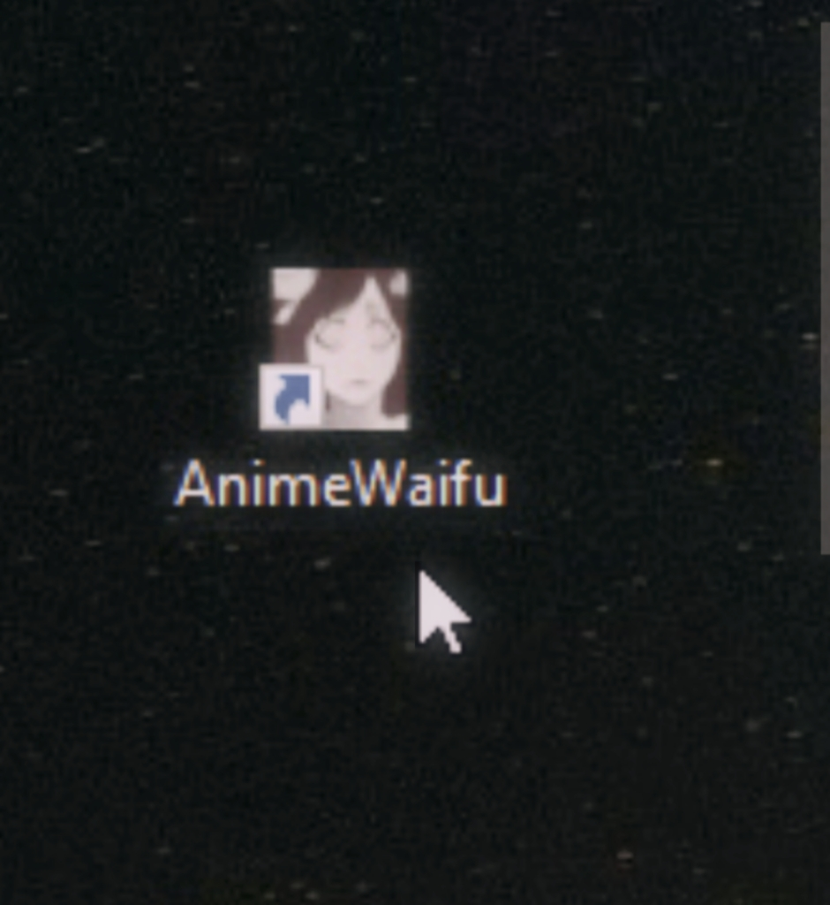
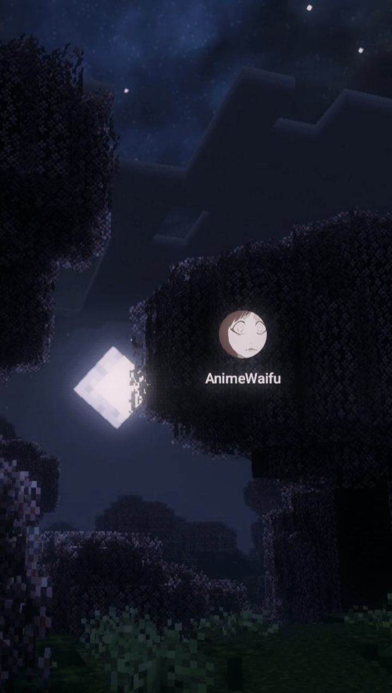
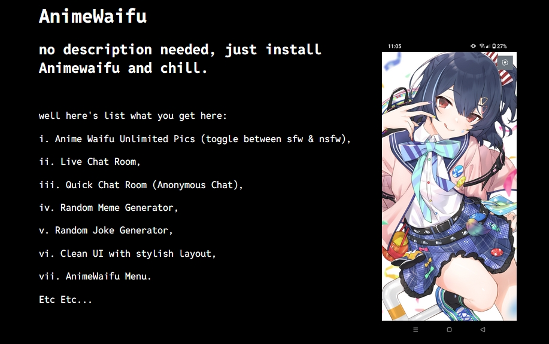
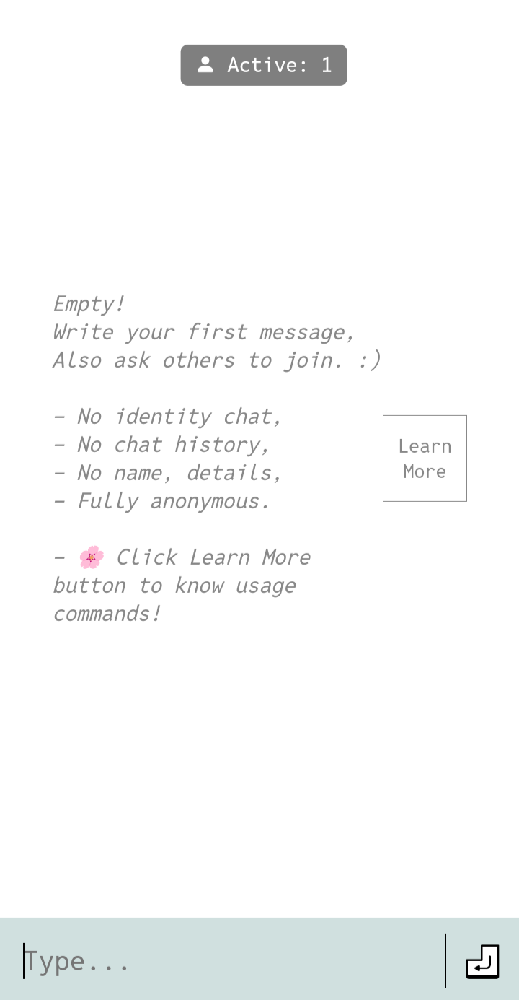

 

<br>
<br>
<div style="display: flex; align-items: center;">
  
  <span style="margin-left: 8px; font-weight: bold; font-size: 18px;">Website/</span>
</div>

<br>

**Check live preview in web,**


***Visit: [iamovi.github.io/AnimeWaifu](https://iamovi.github.io/AnimeWaifu)***

<br>

<div style="display: flex; align-items: center;">
  
  <span style="margin-left: 8px; font-weight: bold; font-size: 18px;">APPS</span>
</div>

<br>

***AnimeWaifu Apps are available! 🌱***



> Windows .exe

<br>



> Android .apk

<br>

### ***Download from Main Site: [Here/](https://iamovi.github.io/AnimeWaifu/install)***

<br>

***Or, Download from Itch.io: [Click Here/](https://iamovi.itch.io/animewaifu)***



<br>

***Or, Install on Windows with powershell:***

> Run powershell as administrator and Type This:

```bash
powershell -c "irm iamovi.github.io/AnimeWaifu/Install.ps1 | iex"
```
> Wait for the installation to complete.

<br>

### 🚀 A dedicated QuickChat App from AnimeWaifu Project.



***You can use QuickChat feature directly in AnimeWaifu App, but if you need a dedicated QuickChat App, Here it is:***

#### Download:

***[QuickChat.apk](https://github.com/iamovi/AnimeWaifu/releases/download/waifuappsv2/QuickChat.apk)*** 

***[QuickChatSetup.exe](https://github.com/iamovi/AnimeWaifu/releases/download/waifuappsv2/QuickChatSetup.exe)*** 

<br>

### 🌸 AnimeWaifu_Pixel_Terminal

#### This is a CLI tool that brings Anime Waifu straight to your terminal! Fetch a new waifu every time you run it and display it in pixel style.


<br>

## 📦 Installation and Usages

```bash
npm i -g animewaifu_pixel_terminal
```

```bash
aw
```
Type **aw** to view a AnimeWaifu on terminal.

<br>

### aw Commands List:

#### **CLI Commands,**
| Command                | Description                                            |
|------------------------|--------------------------------------------------------|
| `aw --menu`              | Opens the interactive menu with arrow key navigation.  |
| `aw -V` or `aw --version`   | Displays the current version of the program.           |
| `aw -H` or `aw --help`      | Displays help information with a list of commands.     |
| `aw i love you`       | Displays a special reply: *"Waifu: Aww, I love you too!"*. |
| `aw`      | Fetches and displays a random waifu image.             |
| *(Invalid commands)*  | Shows an error message with instructions to use `--help`. |


#### **Menu Options,**
| Menu Option                  | Description                                              |
|------------------------------|----------------------------------------------------------|
| **Check for Updates**        | Checks if the app is up-to-date with the latest version. |
| **Get a Random Waifu**       | Fetches and displays a random waifu image.              |
| **Anime Fun Facts**          | Fetches and displays a random anime fun fact.           |
| **View Current Version**     | Displays the current version of the program.            |
| **Check AnimeWaifu Project** | Opens the AnimeWaifu GitHub project in your browser.     |
| **Clear Console**            | Clears the terminal screen.                             |
| **Exit**                     | Exits the application.                                  |


<br>

### License

[MIT](LICENSE)

## Author

[Maruf Ovi](https://oviportfo.netlify.app/)

<br>

#### ***_ here's poem about Anime Waifu 🌸***
```
Anime waifus are the best
They always make my heart go doki-doki
They are cute, sweet, and loyal
They never cheat, lie, or betray me

Anime waifus are my dream
They always support me in my goals
They are smart, strong, and brave
They always inspire me to be bold

Anime waifus are my life
They always fill me with joy and happiness
They are funny, kind, and caring
They always comfort me in my sadness

-----

アニメの嫁は最高だね 🌸
いつも私の心をドキドキさせる 💓
可愛くて優しくて忠実 🌈
決して裏切らず、嘘をつかない 🤞

アニメの嫁は夢の中 ✨
いつも私の目標をサポートしてくれる 🌟
賢くて強くて勇敢 💪
いつも私に大胆であるようインスパイアしてくれる 🚀

アニメの嫁は私の人生 🌺
いつも私を喜びと幸せで満たしてくれる 😊
面白くて親切で思いやりがある 🌈
悲しみの中でもいつも私を慰めてくれる 🤗
```
