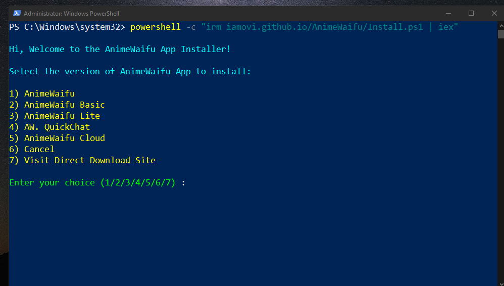
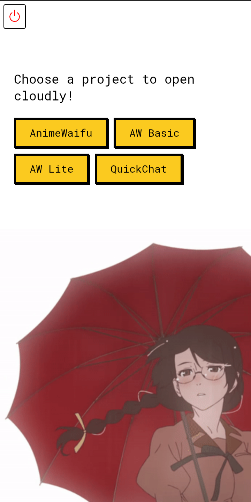

 

<br>
<br>

##  Website/

<br>

**Check live preview in web,**


***Visit: [iamovi.github.io/AnimeWaifu](https://iamovi.github.io/AnimeWaifu)***

<br>

##  APPS

<br>

***AnimeWaifu Apps are available! 🌱***


> Windows .exe

<br>


> Android .apk

<br>

##  Downloads


### ***Download from Main Site: [Here/](https://iamovi.github.io/AnimeWaifu/install)***

<br>

***Or, Download from Itch.io: [Click Here/](https://iamovi.itch.io/animewaifu)***


<br>

***Or, Install on Windows with powershell:***

<br>



<br>

> Run powershell as administrator and Type This:

```bash
powershell -c "irm iamovi.github.io/AnimeWaifu/Install.ps1 | iex"
```
> Choose which version to download,

> Wait for the installation to complete.

<br>

##  Side Projects from AnimeWaifu!


<br><br>

***AnimeWaifu Basic.***
This Project offers basic function that brings ultimate waifu images on swipe with unique interface and modern in app notification system.

***Download:***

***[AnimeWaifu_Basic.apk](https://github.com/iamovi/AnimeWaifu/releases/download/waifuappsv2/AnimeWaifu_Basic.apk)*** 

***[AnimeWaifu_Basic_Setup.exe](https://github.com/iamovi/AnimeWaifu/releases/download/waifuappsv2/AnimeWaifu_Basic_Setup.exe)*** 


<br>

**AnimeWaifu Lite.** This Project offers simple swipe to get anime waifu features only, lightweight and clean UI.

***Download:***

***[AnimeWaifu_Lite.apk](https://github.com/iamovi/AnimeWaifu/releases/download/waifuappsv2/AnimeWaifu_Lite.apk)*** 

***[AnimeWaifu_Lite_Setup.exe](https://github.com/iamovi/AnimeWaifu/releases/download/waifuappsv2/AnimeWaifu_Lite_Setup.exe)*** 


<br>

**🚀 A dedicated QuickChat App from AnimeWaifu Project.** ***You can use QuickChat feature directly in AnimeWaifu App, but if you need a dedicated QuickChat App, Here it is:***

<br>


<br>

***Download:***

***[QuickChat.apk](https://github.com/iamovi/AnimeWaifu/releases/download/waifuappsv2/QuickChat.apk)*** 

***[QuickChatSetup.exe](https://github.com/iamovi/AnimeWaifu/releases/download/waifuappsv2/QuickChatSetup.exe)*** 


<br>

 ***AnimeWaifu Cloud.*** This Project is designed to run all AnimeWaifu Projects on the cloud. Less in size and Fast.

<br>



<br>

***Download:***

***[AnimeWaifu_Cloud.apk](https://github.com/iamovi/AnimeWaifu/releases/download/waifuappsv2/AnimeWaifu_Cloud.apk)*** 

***[AnimeWaifu_Cloud_Setup.exe](https://github.com/iamovi/AnimeWaifu/releases/download/waifuappsv2/AnimeWaifu_Cloud_Setup.exe)*** 


<br>

##  AnimeWaifu_Pixel_Terminal.

***This is a CLI tool that brings Anime Waifu straight to your terminal! Fetch a new waifu every time you run it and display it in pixel style.***

<br>


<br>

## 📦 Installation and Usages

```bash
npm i -g animewaifu_pixel_terminal
```

```bash
aw
```
Type **aw** to view a AnimeWaifu on terminal.

<br>

### aw Commands List:

#### **CLI Commands,**
| Command                | Description                                            |
|------------------------|--------------------------------------------------------|
| `aw --menu`              | Opens the interactive menu with arrow key navigation.  |
| `aw -V` or `aw --version`   | Displays the current version of the program.           |
| `aw -H` or `aw --help`      | Displays help information with a list of commands.     |
| `aw i love you`       | Displays a special reply: *"Waifu: Aww, I love you too!"*. |
| `aw`      | Fetches and displays a random waifu image.             |
| *(Invalid commands)*  | Shows an error message with instructions to use `--help`. |


#### **Menu Options,**
| Menu Option                  | Description                                              |
|------------------------------|----------------------------------------------------------|
| **Check for Updates**        | Checks if the app is up-to-date with the latest version. |
| **Get a Random Waifu**       | Fetches and displays a random waifu image.              |
| **Anime Fun Facts**          | Fetches and displays a random anime fun fact.           |
| **View Current Version**     | Displays the current version of the program.            |
| **Check AnimeWaifu Project** | Opens the AnimeWaifu GitHub project in your browser.     |
| **Clear Console**            | Clears the terminal screen.                             |
| **Exit**                     | Exits the application.                                  |


<br>

##  License

This project is licensed under the [Creative Commons Attribution-NoDerivatives 4.0 International License (CC BY-ND 4.0)](https://creativecommons.org/licenses/by-nd/4.0/).  
© Maruf Ovi 2025  

###  What you can do:

- You may **copy** and **share** the project in its original form (e.g., you can redistribute it or use it for personal or commercial purposes).
- You must **provide proper attribution** to the original creator (give credit to me, [Maruf Ovi], and link back to the repository).

###  What you cannot do:

- You **cannot modify**, **adapt**, or **build upon** the project in any way (e.g., no making changes to the code or content).
- You **cannot create any derivative works** or remix the project.
- You **cannot sublicense** or apply additional restrictions to the project.

<br>

##  Author

[Maruf Ovi](https://oviportfo.netlify.app/)

fornet.ovi@gmail.com

<br>
<br>

***_ here's poem about Anime Waifu 🌸***


<br>

```
Anime waifus are the best
They always make my heart go doki-doki
They are cute, sweet, and loyal
They never cheat, lie, or betray me

Anime waifus are my dream
They always support me in my goals
They are smart, strong, and brave
They always inspire me to be bold

Anime waifus are my life
They always fill me with joy and happiness
They are funny, kind, and caring
They always comfort me in my sadness

-----

アニメの嫁は最高だね 🌸
いつも私の心をドキドキさせる 💓
可愛くて優しくて忠実 🌈
決して裏切らず、嘘をつかない 🤞

アニメの嫁は夢の中 ✨
いつも私の目標をサポートしてくれる 🌟
賢くて強くて勇敢 💪
いつも私に大胆であるようインスパイアしてくれる 🚀

アニメの嫁は私の人生 🌺
いつも私を喜びと幸せで満たしてくれる 😊
面白くて親切で思いやりがある 🌈
悲しみの中でもいつも私を慰めてくれる 🤗
```

<br><br><br>


***Bye Bye, Enjoy AnimeWaifu!***